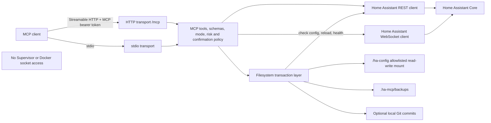

# Home Assistant Admin MCP

A safety-oriented Model Context Protocol (MCP) server for inspecting, controlling, diagnosing, and selectively administering a Home Assistant instance. It combines Home Assistant's REST and WebSocket APIs with an optional, constrained Home Assistant configuration mount.

The server does not include an LLM. An MCP client chooses tools; this server validates input, enforces deployment policy, talks to Home Assistant, and returns structured results.

> [!NOTE]
> This project is built with AI-assisted development tools.

> [!WARNING]
> `admin` mode can change devices, registries, helpers, automations, scripts, scenes, integrations, and YAML configuration, and can restart Home Assistant. Start in `read_only`, use a dedicated Home Assistant account, review dry runs, and expose the HTTP endpoint only to trusted clients.

## Scope And Boundaries

Implemented capabilities include:

- Runtime state, service/action, event, history, logbook, statistics, and current-session log inspection with condensed `system_log` fallback.
- Registry and integration discovery with cross-linked areas, devices, entities, and config entries.
- Validated service calls with explicit targets and live Home Assistant service definitions.
- Editor-managed automation, script, and scene reads and mutations.
- Storage-backed helper and selected registry/config-entry mutations through Home Assistant internal APIs.
- Diagnostics, dependency analysis, searches across registries/editor resources/allowlisted YAML, traces, configuration diffs, checkpoints, and bounded Git history.
- Structural YAML patches under an explicit filesystem allowlist.

Explicit non-goals and limitations:

- No Home Assistant Supervisor API, add-on management, host management, or Home Assistant backup API.
- No Docker API, Docker socket, container lifecycle, image management, or container-log access. The deployment does not mount `/var/run/docker.sock`.
- No arbitrary shell execution or arbitrary filesystem access.
- No generic config-flow/options-flow implementation and no mechanism to submit arbitrary integration credentials. Integration tools only read config entries, change the implemented preferences, enable/disable, or request reload.
- No assumption that every Home Assistant user can call every endpoint. The long-lived token inherits the permissions and administrator status of its Home Assistant user.

## Architecture



HTTP transport is stateless at the MCP handler layer. The application process still shares its Home Assistant connection/cache and serializes filesystem transactions.

## Home Assistant API Matrix

Reviewed on 2026-08-20 against the current Home Assistant documentation and `home-assistant/core` `dev` sources. A source link shows that an internal command currently exists; it is not a stability guarantee.

| Access class              | Implemented surface                                                                                                                                                                     | Stability and requirements                                                                                                                               | References                                                                                                                                                                                                                                                                                                                                                                                                                                                   |
| ------------------------- | --------------------------------------------------------------------------------------------------------------------------------------------------------------------------------------- | -------------------------------------------------------------------------------------------------------------------------------------------------------- | ------------------------------------------------------------------------------------------------------------------------------------------------------------------------------------------------------------------------------------------------------------------------------------------------------------------------------------------------------------------------------------------------------------------------------------------------------------ |
| Public REST               | `/api/`, `/api/config`, `/api/states`, `/api/services`, `/api/events`, `/api/history/period`, `/api/error_log`, `/api/config/core/check_config`, and `/api/services/<domain>/<service>` | Documented Home Assistant API. Individual integrations/services and recorder data must be loaded.                                                        | [REST API](https://developers.home-assistant.io/docs/api/rest/)                                                                                                                                                                                                                                                                                                                                                                                              |
| Public WebSocket protocol | `/api/websocket` authentication, commands, subscriptions, reconnects, `subscribe_events`, and `validate_config`                                                                         | The transport and listed public commands are documented. This server uses REST for most public state/service operations.                                 | [WebSocket API](https://developers.home-assistant.io/docs/api/websocket/)                                                                                                                                                                                                                                                                                                                                                                                    |
| Internal registry API     | `config/entity_registry/*`, `config/device_registry/*`, and `config/area_registry/*`                                                                                                    | Frontend-facing WebSocket commands. Mutations require a Home Assistant administrator and command fields can change between releases.                     | [entity registry](https://github.com/home-assistant/core/blob/dev/homeassistant/components/config/entity_registry.py), [device registry](https://github.com/home-assistant/core/blob/dev/homeassistant/components/config/device_registry.py), [area registry](https://github.com/home-assistant/core/blob/dev/homeassistant/components/config/area_registry.py)                                                                                              |
| Internal config-entry API | `config_entries/get`, `get_single`, `update`, `disable`, plus config-entry reload REST                                                                                                  | Frontend/config-panel implementation, not a general integration authentication or config-flow API.                                                       | [config entries source](https://github.com/home-assistant/core/blob/dev/homeassistant/components/config/config_entries.py)                                                                                                                                                                                                                                                                                                                                   |
| Internal editor API       | `/api/config/{automation,script,scene}/config/<id>`                                                                                                                                     | Applies only to resources managed by Home Assistant's editors/YAML files. Read, write, delete, and response details are version-sensitive.               | [automation](https://github.com/home-assistant/core/blob/dev/homeassistant/components/config/automation.py), [script](https://github.com/home-assistant/core/blob/dev/homeassistant/components/config/script.py), [scene](https://github.com/home-assistant/core/blob/dev/homeassistant/components/config/scene.py)                                                                                                                                          |
| Internal helper API       | `<helper_type>/list`, `create`, `update`, and `delete`                                                                                                                                  | Storage-collection commands for the nine implemented helper types. YAML-backed helpers and config-flow-backed helpers are not made editable by this API. | [storage collection source](https://github.com/home-assistant/core/blob/dev/homeassistant/helpers/collection.py), [input_boolean example](https://github.com/home-assistant/core/blob/dev/homeassistant/components/input_boolean/__init__.py)                                                                                                                                                                                                                |
| Internal diagnostic API   | `system_health/info`, `logbook/get_events`, `trace/list`, `trace/get`, and recorder metadata commands                                                                                   | Used by Home Assistant's frontend/integrations. Availability, permissions, and response shapes can change.                                               | [system health](https://github.com/home-assistant/core/blob/dev/homeassistant/components/system_health/__init__.py), [logbook](https://github.com/home-assistant/core/blob/dev/homeassistant/components/logbook/websocket_api.py), [traces](https://github.com/home-assistant/core/blob/dev/homeassistant/components/trace/websocket_api.py), [recorder](https://github.com/home-assistant/core/blob/dev/homeassistant/components/recorder/websocket_api.py) |
| Filesystem fallback       | Root YAML files, allowlisted YAML directories, local checkpoints, and an optional Git repository under `/ha-config`                                                                     | Local deployment feature, not a Home Assistant API. Requires an explicit read-write mount and host permissions for the non-root process.                 | [path policy](src/security/paths.ts), [transactions](src/config/transaction.ts), [backups](src/config/backups.ts)                                                                                                                                                                                                                                                                                                                                            |

The Home Assistant API requires `Authorization: Bearer <HA token>`. See the official [authentication API](https://developers.home-assistant.io/docs/auth_api/#making-authenticated-requests). The MCP HTTP endpoint has a separate bearer token.

### Internal API Compatibility

- Internal endpoints can be renamed, restricted, or have schemas changed without a public API deprecation period. Test against the exact Home Assistant release before enabling `admin` in production.
- Registry, helper, trace, system-health, logbook WebSocket, recorder metadata, config-entry, and editor operations may return `HA_WS_UNSUPPORTED`, `HA_INTERNAL_API_UNAVAILABLE`, `HELPER_STORAGE_API_UNAVAILABLE`, permission errors, or response-validation errors on incompatible releases.
- Current Home Assistant core marks many registry mutations and trace reads as administrator-only. Use a token belonging to an administrator when those tools are required; a non-admin token can still be appropriate for a read/control-only deployment if its Home Assistant permissions suffice.
- Editor mutations are limited to editor-managed `automations.yaml`, `scripts.yaml`, and `scenes.yaml` resources. A running YAML resource without a usable editor ID is reported as not editable.
- Supported helpers are `input_boolean`, `input_button`, `input_text`, `input_number`, `input_datetime`, `input_select`, `counter`, `timer`, and `schedule`. Their accepted fields are determined by the installed Home Assistant version.
- Config-entry operations do not start config flows, options flows, reauthentication, repairs, OAuth, or credential entry. Use the Home Assistant UI for those operations.
- Dry-run previews for helpers, registries, areas, devices, entities, and config entries do not invoke Home Assistant's mutation validators. Their result includes limitations describing that fact.

## Production Deployment

### Prerequisites

- Docker Engine with Compose v2 and BuildKit.
- A reachable Home Assistant Core instance with the API enabled. Home Assistant's frontend normally provides it; API-only installations need the [`api` integration](https://www.home-assistant.io/integrations/api/).
- A Home Assistant long-lived access token.
- A host path containing the Home Assistant configuration if filesystem, checkpoint, editor mutation safety, or Git features are needed.
- Host ownership/permissions that allow the configured non-root UID/GID to read and write that path.

The image is built locally; no published registry image is assumed.

### Create A Home Assistant Token

1. Sign in to Home Assistant as the user this service should act as.
2. Open **User profile**, then the **Security** tab.
3. In **Long-Lived Access Tokens**, select **Create token** and name it for this deployment.
4. Record the token when shown; Home Assistant does not retain the token string for later display.
5. Use an administrator account only when internal admin tools are required.

Home Assistant documents profile management [here](https://www.home-assistant.io/docs/authentication/#managing-account-access) and long-lived tokens [here](https://developers.home-assistant.io/docs/auth_api/#long-lived-access-token). Long-lived tokens are high-value credentials and should not be committed, placed in `config.example.yaml`, or exposed to an MCP client.

### Compose Setup

```bash
cp .env.example .env
cp config.example.yaml config.yaml
install -d -m 700 secrets
openssl rand -hex 32 > secrets/mcp_auth_token
read -rsp "Home Assistant token: " HA_TOKEN
printf '%s' "$HA_TOKEN" > secrets/home_assistant_token
unset HA_TOKEN
chmod 600 secrets/home_assistant_token secrets/mcp_auth_token
```

Set these values in `.env`:

- `HOME_ASSISTANT_URL`: reachable from the container. `http://host.docker.internal:8123` reaches a Home Assistant port published by the Linux Docker host because Compose installs a `host-gateway` entry. A Home Assistant LAN URL also works.
- `HA_CONFIG_PATH`: existing host Home Assistant configuration directory. It is mounted read-write at `/ha-config`; Compose refuses to create a missing source path.
- `MCP_SETTINGS_FILE`: use `./config.yaml` after making deployment-specific changes.
- `PUID` and `PGID`: non-root IDs with access to `HA_CONFIG_PATH`.
- `MCP_ALLOWED_HOSTS`: every DNS name or IP clients put in the HTTP `Host` header.
- `MCP_BIND_IP`: keep `127.0.0.1` for a local reverse proxy/client; use `0.0.0.0` only for intentional LAN exposure.

Validate, build, and start:

```bash
docker compose config
docker compose build --pull
docker compose up -d
docker compose ps
docker compose logs -f hac-mcp
```

Health endpoints:

```bash
curl --fail http://127.0.0.1:3000/livez
curl --fail http://127.0.0.1:3000/readyz
```

`/livez` reports that the HTTP process is serving. `/readyz` performs an authenticated Home Assistant `/api/` request and returns `503` when Home Assistant is unavailable. Neither endpoint requires the MCP bearer token. The image and Compose healthcheck use `/livez` so a temporary Home Assistant outage does not cause a restart loop.

The runtime filesystem is read-only except for `/tmp`, Docker secret mounts, and `/ha-config`. The image runs as a non-root user and uses `tini` as PID 1; `SIGTERM`/`SIGINT` reach Node, which closes the HTTP handler and Home Assistant WebSocket connection. Git and CA certificates are installed, but no shell-execution MCP tool is implemented.

### Network Placement

The supplied Compose network is an isolated bridge with one published MCP port. It never uses host networking and never mounts a Docker socket.

For Home Assistant connectivity:

- Home Assistant on the Docker host with a published port: use `http://host.docker.internal:8123`.
- Home Assistant on the LAN or a `macvlan`/`ipvlan` network: use its LAN DNS name or IP.
- Home Assistant on another user-defined bridge: attach `hac-mcp` to that external network and use Home Assistant's container DNS name. Replace the bottom network declaration with an `external: true` network or add a second external network to the service.

For MCP client connectivity:

- Keep `MCP_BIND_IP=127.0.0.1` for same-host clients or a same-host reverse proxy.
- Set `MCP_BIND_IP=0.0.0.0` for trusted LAN clients, add the server's LAN IP/DNS names to `MCP_ALLOWED_HOSTS`, and restrict the port with host firewall rules.
- This server does not terminate TLS. Use a trusted reverse proxy for traffic crossing an untrusted network, preserve the `Authorization` header, and configure allowed origin hostnames if a browser client sends `Origin`.

Allowed hosts and origin hostnames mitigate DNS-rebinding/cross-origin access; they do not replace bearer authentication or network controls. MCP's Streamable HTTP security guidance is in the [transport specification](https://modelcontextprotocol.io/specification/2026-07-28/basic/transports/streamable-http#security--endpoint).

## Unraid

Unraid exposes user shares under `/mnt/user`; see the official [share documentation](https://docs.unraid.net/unraid-os/using-unraid-to/manage-storage/shares/). A typical layout is `/mnt/user/appdata/hac-mcp` for this checkout/secrets and the actual Home Assistant appdata directory for `HA_CONFIG_PATH`.

1. Put the project and secret files in a private appdata location. Keep secret files mode `0600` and the directory mode `0700` where practical.
2. Set `HA_CONFIG_PATH` to the exact Home Assistant config directory, for example `/mnt/user/appdata/home-assistant`. Do not mount all of `/mnt/user`.
3. Set `PUID=99` and `PGID=100` only if the Home Assistant files are owned for Unraid's usual `nobody:users` account; otherwise use the actual non-root owner. Confirm that this identity can create `/ha-config/.ha-mcp/backups` and atomically replace allowed YAML files.
4. If the Docker Compose Manager community plugin or a Compose v2 CLI is installed, run the Compose setup above from the project directory. Compose secrets appear as files under `/run/secrets`; Docker documents that behavior [here](https://docs.docker.com/compose/how-tos/use-secrets/).
5. Without Compose, build `home-assistant-admin-mcp:local` and create the container in Unraid's Docker UI using **Advanced View**. Mirror the environment, port, and path settings from `docker-compose.yml`. Bind the two token files read-only to `/run/secrets/home_assistant_token` and `/run/secrets/mcp_auth_token`; these UI bind mounts provide the file interface expected by the app but are not Compose secret objects.
6. Use bridge networking by default. If Home Assistant uses host networking, point `HOME_ASSISTANT_URL` at the Unraid LAN IP and Home Assistant port, or add `host.docker.internal:host-gateway`. If Home Assistant has its own `br0` LAN IP, use that IP. If both containers share a custom Docker network, use Home Assistant's network alias.
7. For LAN MCP access, publish container port `3000`, bind it intentionally, and include the Unraid IP/DNS name in `MCP_ALLOWED_HOSTS`. Keep the bearer token and firewall restriction even on a trusted LAN.
8. Do not add a Docker socket path. Supervisor/container administration is not required or supported.

Unraid's Mover or share settings can change where a user-share file is physically stored without changing `/mnt/user/...`; use one stable user-share path and do not mix equivalent `/mnt/user` and `/mnt/diskX` paths.

## MCP Clients

### Streamable HTTP

The examples below assume the MCP client runs on the same host as Docker and the Compose defaults are unchanged. Point the client at:

```text
http://127.0.0.1:3000/mcp
```

Every request to `/mcp` must carry the separate MCP token:

```http
Authorization: Bearer <contents of secrets/mcp_auth_token>
```

Load the MCP token into the client process environment without putting it in a client configuration file. This token authenticates the MCP client only; never use the Home Assistant token here.

```bash
export HAC_MCP_TOKEN="$(tr -d '\r\n' < /absolute/path/to/secrets/mcp_auth_token)"
```

For a client on another host, replace `127.0.0.1` with the MCP host's address, configure `MCP_BIND_IP`, `MCP_ALLOWED_HOSTS`, firewall rules, and TLS as described under [Network Placement](#network-placement). From another container, `127.0.0.1` means that client container; use a shared-network alias or a host address instead.

### Codex

Add this to user-level `~/.codex/config.toml` or a trusted project's `.codex/config.toml`:

```toml
[mcp_servers.home-assistant-admin]
url = "http://127.0.0.1:3000/mcp"
bearer_token_env_var = "HAC_MCP_TOKEN"
enabled = true
default_tools_approval_mode = "writes"
tool_timeout_sec = 150
```

Restart Codex after setting `HAC_MCP_TOKEN`, then verify the connection with `codex mcp list` or `/mcp` in the Codex TUI. The `writes` approval mode adds a client-side prompt for tools not marked read-only; server-side mode, risk, and confirmation policy still apply independently. See the [Codex MCP documentation](https://developers.openai.com/codex/mcp/).

### OpenCode

Merge this into project-level `opencode.json` or your global OpenCode configuration:

```json
{
  "$schema": "https://opencode.ai/config.json",
  "mcp": {
    "home-assistant-admin": {
      "type": "remote",
      "url": "http://127.0.0.1:3000/mcp",
      "enabled": true,
      "oauth": false,
      "headers": {
        "Authorization": "Bearer {env:HAC_MCP_TOKEN}"
      },
      "timeout": 150000
    }
  }
}
```

Restart OpenCode after setting `HAC_MCP_TOKEN`. Run `opencode mcp list` to check status or `opencode mcp debug home-assistant-admin` to diagnose the connection. In prompts, refer to the server by name when needed, for example, `Use home-assistant-admin to list unavailable entities.` See the [OpenCode MCP documentation](https://opencode.ai/docs/mcp-servers/).

### Claude Code

Create or merge this `.mcp.json` in the project where you run Claude Code:

```json
{
  "mcpServers": {
    "home-assistant-admin": {
      "type": "http",
      "url": "http://127.0.0.1:3000/mcp",
      "headers": {
        "Authorization": "Bearer ${HAC_MCP_TOKEN}"
      },
      "timeout": 150000
    }
  }
}
```

The environment-variable reference is safe to share; do not replace it with a literal token in a committed file. After setting `HAC_MCP_TOKEN`, run `claude mcp list`, start `claude`, approve the project-scoped server when prompted, and use `/mcp` to inspect its status. See the [Claude Code MCP documentation](https://code.claude.com/docs/en/mcp).

### Verify And Use

A low-level initialization probe is useful for diagnosing endpoint, proxy, and authentication failures independently of a client:

```bash
curl --fail-with-body http://127.0.0.1:3000/mcp \
  -H "Authorization: Bearer ${HAC_MCP_TOKEN}" \
  -H 'Content-Type: application/json' \
  -H 'Accept: application/json, text/event-stream' \
  --data '{"jsonrpc":"2.0","id":1,"method":"initialize","params":{"protocolVersion":"2025-11-25","capabilities":{},"clientInfo":{"name":"curl-probe","version":"1.0.0"}}}'
```

Use a real MCP client for normal operation; it performs initialization, protocol-version negotiation, notifications, and tool calls correctly. The server accepts JSON or SSE responses in `auto` response mode and uses a stateless HTTP handler. Useful first prompts include:

- `Use home-assistant-admin to summarize the Home Assistant instance and list unavailable entities. Do not make changes.`
- `Use home-assistant-admin to diagnose why <entity> is unavailable. Read configuration and recent logs only.`
- In `control` mode: `Turn on <explicit entity_id>. Do not target an area or device.`
- In `admin` mode: `Dry-run the requested configuration change, show the diff and validation result, and wait for confirmation before applying it.`

The client cannot elevate the server's configured mode. Start in `read_only`; change `MCP_MODE` in `.env` and recreate the Compose service only after reviewing the permissions and deployment exposure.

### stdio

Build first with `pnpm build`, then configure a local MCP client to launch the server. HTTP authentication is not used on stdio because the MCP client owns the subprocess and pipe.

```json
{
  "mcpServers": {
    "home-assistant-admin": {
      "command": "node",
      "args": ["/workspaces/hac-mcp/dist/index.js"],
      "env": {
        "MCP_CONFIG_FILE": "/workspaces/hac-mcp/config.example.yaml",
        "MCP_TRANSPORT": "stdio",
        "MCP_MODE": "read_only",
        "HOME_ASSISTANT_URL": "http://homeassistant.local:8123",
        "HOME_ASSISTANT_TOKEN_FILE": "/absolute/private/path/home_assistant_token",
        "HA_CONFIG_PATH": "/absolute/path/to/home-assistant/config"
      }
    }
  }
}
```

The server writes logs only to stderr in stdio mode. The Docker healthcheck is HTTP-specific, so do not use the default Docker healthcheck if intentionally running the image as a stdio subprocess.

## Authentication And Configuration

There are two independent credentials:

| Credential                            | Consumer         | Purpose                                                                                   |
| ------------------------------------- | ---------------- | ----------------------------------------------------------------------------------------- |
| Home Assistant long-lived token       | This server      | Authenticates REST and WebSocket requests to Home Assistant with that user's permissions. |
| MCP auth token, minimum 16 characters | MCP HTTP clients | Authenticates every request to `/mcp`. It is not sent to Home Assistant.                  |

For both tokens, a `*_FILE` variable takes precedence over the direct environment variable and surrounding whitespace is trimmed:

- `HOME_ASSISTANT_TOKEN_FILE` over `HOME_ASSISTANT_TOKEN`.
- `MCP_AUTH_TOKEN_FILE` over `MCP_AUTH_TOKEN`.

`MCP_AUTH_TOKEN` or its file is mandatory for HTTP and not required for stdio. Bearer comparison uses SHA-256 digests and a timing-safe comparison. TLS is still required when the network is not trusted because bearer tokens are replayable.

Configuration is loaded from `MCP_CONFIG_FILE`, then environment values override the file. Supported environment overrides are:

| Area           | Environment variables                                                                                                                          |
| -------------- | ---------------------------------------------------------------------------------------------------------------------------------------------- |
| Home Assistant | `HOME_ASSISTANT_URL`, `HOME_ASSISTANT_TOKEN`, `HOME_ASSISTANT_TOKEN_FILE`, `HA_REQUEST_TIMEOUT_MS`, `HA_WEBSOCKET_TIMEOUT_MS`, `HA_VERIFY_TLS` |
| MCP            | `MCP_MODE`, `MCP_TRANSPORT`, `MCP_HOST`, `MCP_PORT`, `MCP_AUTH_TOKEN`, `MCP_AUTH_TOKEN_FILE`, `MCP_ALLOWED_HOSTS`, `MCP_ALLOWED_ORIGINS`       |
| Filesystem     | `HA_CONFIG_PATH`, `HA_FILESYSTEM_ENABLED`, `HA_ALLOW_SECRET_VALUES`, `HA_ALLOW_CUSTOM_COMPONENTS`, `HA_ALLOWED_CONFIG_DIRECTORIES`             |
| Git            | `HA_GIT_ENABLED`                                                                                                                               |

Comma-separated variables are trimmed. Only environment variables that are present override YAML values. Limits, permissions, cache TTLs, secret metadata policy, backup directory, and Git author identity otherwise come from YAML defaults or the configuration file.

## Modes, Risk, And Confirmation

Every tool is registered with a risk level and remains visible to clients. Policy is enforced again at invocation.

`call_service` has a `CONTROL` baseline but escalates known administrative arguments before authorization: restart/stop, backup, and recorder purge actions become `HIGH_IMPACT`; reload, logger, and config actions become `CONFIG`. The effective risk is returned in each result, and custom MCP metadata marks the tool as dynamically classified.

| Mode        | Allowed risk levels                        | Intended use                                                                                    |
| ----------- | ------------------------------------------ | ----------------------------------------------------------------------------------------------- |
| `read_only` | `READ`                                     | Inventory, state, diagnostics, logs, history, traces, config reads, diffs, and validation.      |
| `control`   | `READ`, `CONTROL`                          | Adds targeted service calls, scene/script execution, and automation enable/disable/trigger.     |
| `admin`     | `READ`, `CONTROL`, `CONFIG`, `HIGH_IMPACT` | Adds persistent registry/resource/filesystem changes, reloads, rollback, deletion, and restart. |

`permissions.requireConfirmationFor` defaults to `HIGH_IMPACT`. A matching tool must receive `confirm: true`; otherwise it returns `CONFIRMATION_REQUIRED` with retry metadata. Add `CONTROL` and/or `CONFIG` to require confirmation more broadly.

Sensitive-domain policy is independent of mode:

- `allow`: normal mode/risk policy applies.
- `confirm`: explicit `confirm: true` is required.
- `deny`: the operation is rejected even in `admin` mode.

Defaults require confirmation for `lock`, `alarm_control_panel`, and `siren`. Explicit cover entity IDs containing `garage` or `gate` also require confirmation. Policy evaluates every explicit entity in a multi-entity target. Area/device targets cannot be expanded safely at authorization time, so deny or require confirmation for the whole service domain when that distinction matters.

## Dry Runs

`dry_run: true` is implemented on persistent resource, helper, registry, area, device, entity, config-entry, YAML patch, administrative lifecycle, rollback, and generic service-call tools. Convenience physical-control tools do not simulate actions.

- YAML patches parse and validate the resulting YAML and return a redacted structured diff without writing, checkpointing, reloading, checking full Home Assistant configuration, or committing.
- Local YAML parsing rejects syntax errors, duplicate mapping keys, unresolved aliases, and excessive alias expansion. A non-dry apply subsequently runs Home Assistant's complete config check and attempts rollback on rejection; local validation is not a substitute for Home Assistant's domain validation.
- Automation/script/scene dry runs read the current editor resource, create a JSON diff, and invoke the implemented fragment validation where available, but do not write or create a checkpoint.
- Helper, registry, area, device, entity, and config-entry dry runs read current data and construct a preview. They do not call the internal mutation endpoint and do not perform Home Assistant's server-side mutation validation.
- Config-entry reload dry run reports the proposed reload but cannot predict runtime effects.
- Reload, restart, checkpoint rollback, and service-owned Git rollback dry runs validate available identifiers/current metadata and describe the proposed high-impact action without applying it.
- Generic `call_service` supports dry-run validation against the live service definition; the service is not called. Convenience physical-control tools intentionally do not simulate actions.
- A successful dry run proves only the validations described in its result. It does not guarantee that state, permissions, internal APIs, files, or integration behavior will be unchanged at apply time.

## Filesystem Safety

Filesystem access is disabled as a unit with `HA_FILESYSTEM_ENABLED=false`. When enabled, requests are canonicalized under `filesystem.root`, every path segment is checked, and symlinks are rejected.

Allowed paths:

- Any `.yaml` or `.yml` file directly under the configuration root.
- YAML below configured `allowedDirectories`, defaulting to `packages` and `themes`, recursively to scan depth 32.
- Selected `.json`, `.py`, `.pyi`, `.yaml`, and `.yml` under `custom_components/<integration>/...` only when custom-component policy is enabled. Dedicated tools provide bounded source reads; no source write tool or Python execution/validation path is exposed.

Always protected or denied:

- `.storage`, `.git`, Home Assistant database formats, private-key formats/names, and path names matching the implemented auth, credential, token, or backup-key patterns.
- Paths outside the root, invalid path segments, missing write parents, non-regular files, and all symlinks.
- `secrets.yaml` and `secrets.yml` values by default. With `allowSecretsMetadata: true`, tools can return sorted top-level secret key names, byte count, and timestamps without values.

With `allowSecretValues: false`, sensitive snake_case, camelCase, and hyphenated keys such as `password`, `clientSecret`, `token`, `apiKey`, `private-key`, `credential`, `authorization`, and `cookie` are normalized and redacted recursively. `!secret`/`!env_var` values and matching diff lines are also redacted.

These checks are pattern-based, not a content scanner, so uncommon secret names may not match every guard. Keep actual values in the protected root `secrets.yaml`, do not store credentials in other allowlisted YAML, and inspect redacted output before giving it to an untrusted model. Setting `HA_ALLOW_SECRET_VALUES=true` explicitly allows secret-bearing YAML, including root `secrets.yaml`, to be read and patched; use this exceptional recovery option only with fully trusted clients.

Writes use temporary files, `O_NOFOLLOW`, `fsync`, atomic rename, preserved modes, SHA-256 optimistic-concurrency checks, and parent-directory sync where supported.

## Checkpoints, Transactions, And Rollback

`patch_yaml_file` non-dry-run workflow:

1. Resolve allowlisted paths, read current hashes, apply structural YAML operations, and validate syntax.
2. Create a mode-preserving checkpoint under `/ha-config/.ha-mcp/backups` by default.
3. Recheck hashes and atomically write each file. Only one config transaction runs per server process.
4. Ask Home Assistant to check its complete configuration.
5. Reload the affected automation/script/scene domain, or call `homeassistant.reload_all` for other/multiple paths unless `reload: false`.
6. Read Home Assistant config as a health check.
7. On a failure after writes begin, restore applied files only if their hashes still match the transaction output, then attempt reload and health checks.
8. Optionally commit only the changed paths to Git. Git failure becomes a warning after a successful Home Assistant change; it does not roll back the change.

Editor-managed automation/script/scene mutations create a filesystem checkpoint before calling the internal editor endpoint, require the config mount for non-dry-run changes, verify editor config and runtime presence/absence with bounded retries, run Home Assistant config validation, and attempt editor-level rollback if apply or verification fails.

`rollback_change` first creates a safety checkpoint of the current files, restores the selected checkpoint with current-hash conflict checks, validates Home Assistant config, and reloads. If validation/reload fails, it attempts to restore the safety checkpoint and reports any recovery failure. Checkpoints are local file snapshots, not Home Assistant Supervisor backups, and retention cleanup is not automatic.

## Git Behavior And Limits

Git is optional and operates only when `/ha-config` is inside a detected repository. The image includes the Git CLI.

- Status, history, and diffs are restricted to paths accepted by the configuration path policy.
- Commits stage and commit only selected allowed paths. Hooks are disabled, signing is disabled, and author/committer identity comes from configuration.
- The server does not initialize, clone, fetch, pull, push, merge, rebase, manage remotes, credentials, branches, tags, or submodules.
- Target paths are checked before mutation. If an affected file already has staged or working-tree changes, the Home Assistant operation may proceed with its checkpoint but automatic Git commit is skipped so pre-existing human edits are not swept into an MCP commit. Unrelated paths remain untouched.
- `rollback_to_commit` accepts only current `HEAD`, only a commit whose author email matches the configured service email, not an initial commit, and only when affected paths have no uncommitted changes.
- Git rollback writes a new compensating commit rather than resetting history. If Home Assistant validation fails, another service-owned rollback is attempted to restore the prior state.
- Git commands time out after 30 seconds. Normal output is bounded to 4 MiB; diffs are bounded to four times `maxReadBytes`, capped at 16 MiB.

## Tools

Names below are derived from `src/mcp/tools`. Client-visible schemas, descriptions, annotations, risk, source, and stability metadata are returned by MCP discovery.

### Discovery

- Instance: `get_home_assistant_info`, `get_system_health`, `get_config`.
- Integrations: `list_integrations`, `get_integration`.
- Areas: `list_areas`, `get_area`.
- Devices: `list_devices`, `get_device`, `search_devices`.
- Entities: `list_entities`, `get_entity`, `search_entities`.
- Cross-registry search: `search_home_assistant_registry`.

### Runtime And History

- Services/events: `list_services`, `list_event_types`, `get_events`, `subscribe_events`.
- States: `get_state`, `get_states`, `get_states_by_area`, `get_states_by_device`.
- Recorder data: `get_history`, `get_logbook`, `get_statistics`, `get_recorder_statistics`.

### Control

- Generic/standard control: `call_service`, `turn_on`, `turn_off`, `toggle`, `set_value`, `set_temperature`.
- Execution: `activate_scene`, `run_script`.

### Automations, Scripts, Scenes, And Traces

- Automations: `list_automations`, `get_automation`, `create_automation`, `update_automation`, `delete_automation`, `enable_automation`, `disable_automation`, `trigger_automation`, `reload_automations`, `validate_automation`.
- Scripts: `list_scripts`, `get_script`, `create_script`, `update_script`, `delete_script`, `run_script_by_id`, `reload_scripts`, `validate_script`.
- Scenes: `list_scenes`, `get_scene`, `create_scene`, `update_scene`, `delete_scene`, `activate_scene_resource`, `reload_scenes`.
- Automation traces: `get_automation_traces`, `get_automation_trace`, `explain_automation_failure`, `get_last_automation_run`.
- Generic traces: `get_trace`, `list_traces`, `explain_trace`, `get_last_trace`.

### Helpers And Registries

- Helpers: `list_helpers`, `get_helper`, `create_helper`, `update_helper`, `delete_helper`.
- Entity registry: `update_entity_registry`, `disable_entity`, `enable_entity`, `rename_entity`, `move_entity_to_area`.
- Device registry: `update_device`, `rename_device`, `move_device_to_area`, `disable_device`, `enable_device`.
- Area registry: `create_area`, `update_area`, `delete_area`, `assign_device_to_area`, `assign_entity_to_area`.
- Config entries: `get_config_entries`, `get_config_entry`, `reload_config_entry`, `update_integration`, `enable_integration`, `disable_integration`.

### Configuration And Recovery

- Read/list: `read_configuration`, `list_configuration_files`, `read_yaml_file`, `list_custom_component_files`, `read_custom_component_source`.
- Patch/validate: `patch_yaml_file`, `validate_configuration`, `validate_home_assistant_configuration`.
- Reload/restart: `reload_configuration`, `reload_yaml_configuration`, `restart_home_assistant`.
- History/diff: `get_config_history`, `get_config_diff`, `get_recent_changes`.
- Rollback: `rollback_change`, `rollback_to_commit`.

### Logs, Diagnostics, Dependencies, And Search

- Logs: `get_home_assistant_logs`, `search_logs`, `get_errors`, `get_warnings`, `get_recent_errors`, `get_integration_errors`.
- Entity/device findings: `find_unavailable_entities`, `find_disabled_entities`, `find_orphaned_entities`, `find_orphaned_devices`, `find_duplicate_entities`, `find_entities_without_area`, `find_devices_without_area`, `find_stale_sensors`.
- Automation/helper findings: `find_unused_helpers`, `find_broken_automations`, `find_automation_errors`, `find_automations_referencing_missing_entities`.
- Dependencies/search: `get_entity_dependencies`, `get_automation_dependencies`, `search_home_assistant`.

## Example User Requests

- "List unavailable entities in the kitchen and include their device and integration relationships."
- "Show ERROR and CRITICAL log entries for the `zha` integration from the last hour."
- "Explain the most recent failed run of automation ID `garage_arrival`."
- "Find automations that reference missing entities, then show each automation's dependencies."
- "Dry-run a structural YAML patch that changes `packages/lighting.yaml`; show the redacted diff only."
- "Turn off `light.office`, but do not target any other entities."
- "Create an `input_boolean` helper for guest mode as a dry run and report the validation limitations."
- "Delete scene ID `old_evening` with explicit confirmation, then report checkpoint, config validation, verification, rollback, and Git results."

The model/client must translate a request into the exact tool schema. A natural-language request does not bypass mode, risk, confirmation, path, or Home Assistant authorization checks.

## Performance And Limits

Defaults and hard bounds are designed to prevent an MCP call from becoming an unbounded Home Assistant or filesystem query.

| Resource                                         | Implemented limit                                                                                                                            |
| ------------------------------------------------ | -------------------------------------------------------------------------------------------------------------------------------------------- |
| MCP HTTP JSON body                               | 1 MiB default; configurable from 1 KiB to 10 MiB in YAML.                                                                                    |
| Home Assistant REST response / WebSocket payload | 10 MiB.                                                                                                                                      |
| REST and WebSocket command timeout               | 30 seconds default; configurable from 1 to 120 seconds.                                                                                      |
| Registry/service cache                           | 30 seconds default; configurable from 1 second to 1 hour; concurrent loads are coalesced.                                                    |
| Pagination                                       | Usually 100 default, 500 maximum.                                                                                                            |
| Allowed config file                              | 2 MiB default; configurable from 1 KiB to 20 MiB.                                                                                            |
| Configuration listing                            | 5,000 scanned entries, 1,000 files, directory depth 32.                                                                                      |
| YAML patch / local validation                    | 100 operations per patch; 50 files per validation/rollback selection.                                                                        |
| Service calls                                    | 100 IDs per target kind and 100 service-data fields; service data is checked against the live definition.                                    |
| History/statistics                               | 100 entity IDs or statistic IDs per call.                                                                                                    |
| Logbook                                          | 100 entity/device filter IDs and 5,000 returned entries.                                                                                     |
| Event collection tool                            | 250 events and 120 seconds maximum. Underlying client allows at most 1,000 collected events, 100 subscriptions, and 1,000 pending commands.  |
| Parsed logs                                      | 2 MiB source/output, 10,000 lines, and 2,000 entries maximum; defaults are lower.                                                            |
| Diagnostic resources                             | First 500 editable resources per domain at concurrency 10, plus 200 redacted allowlisted YAML files; partial snapshots report source errors. |
| Config transactions                              | One active filesystem transaction per process.                                                                                               |

Long history/logbook windows and full diagnostics can still be expensive inside Home Assistant's recorder. Filter by entity, device, integration, time range, and page whenever possible.

## Development

Node.js 22.23.1 and pnpm 11.21.0 are required.

```bash
corepack enable
pnpm --version
pnpm install --frozen-lockfile
pnpm build
```

### Dependency Supply Chain

- Direct dependencies use exact versions; the lockfile pins the complete graph with registry integrity hashes.
- pnpm rejects releases less than 10,080 minutes (seven days) old, packages without publication times, publisher-trust downgrades, exotic transitive sources, and unapproved dependency build scripts. It also revalidates lockfile resolution data against the pinned npm registry on every install.
- Installs use a frozen lockfile by default. Dependency changes require an explicit, reviewed `pnpm install --no-frozen-lockfile`, followed by `pnpm supply-chain:check`, the normal validation suite, and a committed lockfile diff.
- Transitive overrides pin eligible `content-type` and `hono` releases while newer versions remain inside the quarantine window, and pin `undici-types` to an attested release that does not downgrade publisher trust. Re-evaluate, but do not automatically remove, these overrides during a reviewed dependency update.
- CI actions and container base images use immutable commit or content digests. Runtime Debian packages come from a dated snapshot, so rebuilding does not silently upgrade them.
- Do not add a `minimumReleaseAgeExclude` exception. For an urgent security release, wait until it has aged seven days or obtain explicit approval to change this policy in a reviewed change.

HTTP development:

```bash
HOME_ASSISTANT_URL=http://homeassistant.local:8123 \
HOME_ASSISTANT_TOKEN_FILE=/absolute/private/path/home_assistant_token \
MCP_AUTH_TOKEN_FILE=/absolute/private/path/mcp_auth_token \
MCP_CONFIG_FILE=./config.example.yaml \
MCP_TRANSPORT=http \
MCP_HOST=127.0.0.1 \
MCP_ALLOWED_HOSTS=localhost,127.0.0.1 \
HA_CONFIG_PATH=/absolute/path/to/home-assistant/config \
pnpm dev
```

For API-only development, set `HA_FILESYSTEM_ENABLED=false` and `HA_GIT_ENABLED=false`; editor resource mutations that require checkpoints will then be unavailable by design.

## Testing And Validation

Run the repository checks:

```bash
pnpm supply-chain:check
pnpm audit --prod --audit-level high
pnpm typecheck
pnpm lint
pnpm format:check
pnpm test
pnpm build
```

Validate deployment files where Docker is available:

```bash
docker compose config
docker build --check -t home-assistant-admin-mcp:check .
docker build -t home-assistant-admin-mcp:local .
```

Then test `/livez`, `/readyz`, an MCP initialize request, and representative read-only tools against a non-production Home Assistant instance. Before enabling `admin`, test internal API reads, dry runs, a disposable mutation, checkpoint rollback, and Git behavior against the exact Home Assistant version and filesystem used in production.

## Troubleshooting

### Server Does Not Start

- `INVALID_CONFIGURATION`: parse `config.yaml`, check exact camelCase keys, numeric ranges, URLs, email format, and the flattened validation details in stderr.
- `MCP_AUTH_REQUIRED`: HTTP requires `MCP_AUTH_TOKEN` or `MCP_AUTH_TOKEN_FILE`, with at least 16 characters after trimming.
- `ENOENT` for a secret: Compose secret source paths are host paths relative to the Compose project. Confirm `.env` and file permissions.
- Docker healthcheck fails in stdio mode: `/livez` exists only in HTTP mode; remove/override the healthcheck for intentional stdio containers.

### MCP HTTP 401, 403, Or 413

- `401`: the MCP bearer token is absent, malformed, or wrong. The authentication scheme is case-insensitive and must be `Bearer`.
- `403` before a tool call: add the request's actual hostname to `MCP_ALLOWED_HOSTS` and, for browser clients, its origin hostname without scheme or port to `MCP_ALLOWED_ORIGINS`. Do not add arbitrary wildcards.
- `413` or JSON parse rejection: reduce the request or increase `mcp.maxRequestBytes` within the 10 MiB bound.
- Reverse proxy failures: preserve `Authorization`, `Host`, `Origin`, `Accept`, `Content-Type`, `MCP-Protocol-Version`, HTTP streaming, and SSE behavior.

### `/readyz` Is 503 Or Home Assistant Calls Fail

- From inside a bridge container, `localhost` is the MCP container, not Home Assistant. Use `host.docker.internal`, a LAN address, or a shared-network alias.
- `HA_AUTH_FAILED`/`HA_WS_AUTH_FAILED`: replace or recreate the Home Assistant long-lived token.
- `HA_PERMISSION_DENIED`: the token's user lacks permission or administrator status for the requested internal command.
- `HA_TLS_ERROR`/`HA_WS_TLS_ERROR`: install a trusted certificate chain or, only on a controlled private network, set `HA_VERIFY_TLS=false` with full awareness that server identity is no longer verified.
- History, logbook, or statistics errors: verify the recorder/logbook integration is loaded and requested IDs/time ranges exist.

### Filesystem Or Git Fails

- `CONFIG_ROOT_UNAVAILABLE`/permission denied: make `HA_CONFIG_PATH` correct and writable by `PUID:PGID`; the container intentionally does not run as root.
- `CONFIG_PATH_NOT_ALLOWED`: use root YAML or an allowed directory; protected paths, symlinks, arbitrary extensions, and missing parents are rejected.
- `CONFIG_CONCURRENT_MODIFICATION`/`ROLLBACK_CONFLICT`: another process changed the file. Re-read, review, and retry rather than forcing an overwrite.
- `Git is enabled but no repository was detected`: initialize/manage the repository outside MCP or set `HA_GIT_ENABLED=false`.
- Git reports dubious ownership: align the container UID/GID with repository ownership. Do not solve it by running the container as root.
- Checkpoints consume space: inspect and apply an operator-defined retention policy to `.ha-mcp/backups`; there is no automatic deletion tool.

### Internal Tools Fail After A Home Assistant Upgrade

- Confirm the command still exists in the linked current core source and compare request/response fields.
- Retry a read-only operation first. Do not repeatedly retry a mutation when verification or rollback status is uncertain.
- Use Home Assistant's UI for helpers, integrations, or resources whose internal endpoint changed.
- Keep `MCP_MODE=read_only` until compatibility is tested and reviewed.

## License

[MIT](LICENSE)
